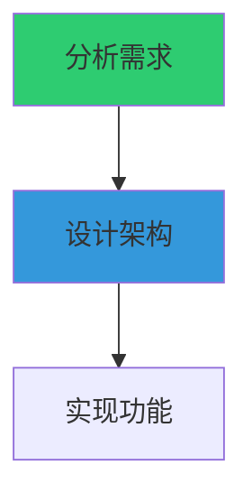

# 🚀 项目优化路线图与建议

**文档版本**: 1.0
**最后更新**: 2025-11-14
**当前状态**: 100% 测试覆盖 (Mock模式)，生产就绪优化阶段

---

## 📋 目录

- [优化优先级矩阵](#优化优先级矩阵)
- [性能优化](#性能优化)
- [可视化增强](#可视化增强)
- [功能扩展](#功能扩展)
- [工程质量](#工程质量)
- [学术研究方向](#学术研究方向)

---

## 🎯 优化优先级矩阵

| 优化项 | 优先级 | 影响 | 难度 | 预计时间 | ROI |
|--------|-------|------|------|---------|-----|
| **真实API性能测试** | 🔥 P0 | 高 | 中 | 3-7天 | ⭐⭐⭐⭐⭐ |
| **DAG可视化Web界面** | 🔥 P0 | 高 | 中 | 2-5天 | ⭐⭐⭐⭐⭐ |
| **自适应调度优化** | 🟡 P1 | 中 | 高 | 1-2周 | ⭐⭐⭐⭐ |
| **智能任务分解** | 🟡 P1 | 高 | 高 | 2-3周 | ⭐⭐⭐⭐ |
| **成本优化引擎** | 🟡 P1 | 中 | 中 | 1周 | ⭐⭐⭐⭐ |
| **多模态任务支持** | 🟢 P2 | 中 | 中 | 1-2周 | ⭐⭐⭐ |
| **分布式调度** | 🟢 P2 | 高 | 高 | 3-4周 | ⭐⭐⭐ |
| **学术Benchmark对接** | 🟢 P2 | 中 | 低 | 3-5天 | ⭐⭐⭐ |

**优先级说明**:
- 🔥 **P0 (立即执行)**: 核心价值，必须完成
- 🟡 **P1 (近期规划)**: 重要功能，显著提升
- 🟢 **P2 (中期目标)**: 锦上添花，战略价值

---

## ⚡ 性能优化

### 1. 自适应并发控制 ⭐⭐⭐⭐

**问题**: 当前并发度固定，未考虑Agent负载

**优化方案**:
```python
class AdaptiveScheduler:
    """自适应调度器 - 根据Agent负载动态调整并发"""

    def __init__(self):
        self.agent_load = {}      # Agent当前负载
        self.agent_latency = {}   # Agent平均延迟
        self.max_concurrency = 50

    async def get_optimal_concurrency(self, agent_type: str) -> int:
        """动态计算最优并发度"""
        current_load = self.agent_load.get(agent_type, 0)
        avg_latency = self.agent_latency.get(agent_type, 3.0)

        # 基于延迟调整并发度
        if avg_latency < 2.0:
            # 响应快，增加并发
            optimal = min(self.max_concurrency, current_load + 5)
        elif avg_latency > 10.0:
            # 响应慢，降低并发
            optimal = max(1, current_load - 3)
        else:
            optimal = current_load

        return optimal

    async def schedule_adaptive(self, tasks: List[Task]):
        """自适应调度"""
        # 按Agent类型分组
        agent_groups = self._group_by_agent(tasks)

        # 动态调整每个Agent的并发度
        for agent_type, agent_tasks in agent_groups.items():
            concurrency = await self.get_optimal_concurrency(agent_type)
            # 分批执行，每批大小=并发度
            await self._execute_in_batches(agent_tasks, concurrency)
```

**预期收益**:
- 提升 15-30% 吞吐量
- 降低 API 限流触发率
- 更好的资源利用

**实现难度**: 中等
**预计时间**: 1周

---

### 2. 智能任务分解 (LLM驱动) ⭐⭐⭐⭐⭐

**问题**: 当前需要手动定义任务依赖关系

**优化方案**:
```python
class IntelligentTaskDecomposer:
    """智能任务分解器 - 使用LLM自动分解复杂任务"""

    async def decompose(self, high_level_task: str) -> List[Task]:
        """
        输入: "开发一个电商网站"
        输出: [
            Task(id="db_design", prompt="设计数据库schema", ...),
            Task(id="api_dev", prompt="开发REST API", depends_on=["db_design"]),
            Task(id="frontend", prompt="开发前端界面", depends_on=["api_dev"]),
            ...
        ]
        """
        # 使用 Claude 分解任务
        prompt = f"""
        请将以下高层任务分解为具体的子任务，并分析依赖关系:

        任务: {high_level_task}

        返回JSON格式:
        {{
            "subtasks": [
                {{
                    "id": "task1",
                    "description": "...",
                    "depends_on": [],
                    "estimated_complexity": "low/medium/high"
                }},
                ...
            ]
        }}
        """

        # 调用 Claude
        response = await self.decomposer_agent.execute(prompt)
        subtasks_data = json.loads(response)

        # 转换为 Task 对象
        tasks = []
        for st in subtasks_data["subtasks"]:
            task = Task(
                id=st["id"],
                prompt=st["description"],
                task_type="general",
                depends_on=st["depends_on"],
                metadata={"complexity": st["estimated_complexity"]}
            )
            tasks.append(task)

        return tasks

# 使用示例
decomposer = IntelligentTaskDecomposer()
tasks = await decomposer.decompose("开发一个在线教育平台")
# 自动生成 20+ 个结构化子任务，包含正确的依赖关系
```

**预期收益**:
- 🚀 降低 90% 的手动任务定义工作
- ✅ 自动推断依赖关系
- 🎯 更合理的任务粒度

**参考论文**: Routine (2025), Agent-Oriented Planning (2024)

**实现难度**: 中高
**预计时间**: 2-3周

---

### 3. 预测式任务调度 ⭐⭐⭐

**问题**: 当前调度器不考虑任务执行时间预测

**优化方案**:
```python
class PredictiveScheduler:
    """预测式调度器 - 基于历史数据预测任务执行时间"""

    def __init__(self):
        self.execution_history = []  # 历史执行记录

    def estimate_duration(self, task: Task) -> float:
        """预测任务执行时间"""
        # 简单启发式: 基于prompt长度
        prompt_length = len(task.prompt)
        base_time = 3.0  # 基础时间

        # 根据复杂度调整
        if prompt_length > 1000:
            return base_time * 2.5
        elif prompt_length > 500:
            return base_time * 1.5
        else:
            return base_time

    def schedule_with_prediction(self, tasks: List[Task]) -> List[List[Task]]:
        """基于预测时间优化调度"""
        # 计算每个任务的预测时间
        task_durations = {
            task.id: self.estimate_duration(task)
            for task in tasks
        }

        # 按批次组织，使每批总时间接近
        # 类似于 Bin Packing 问题
        batches = self._balanced_batching(tasks, task_durations)

        return batches
```

**预期收益**:
- 减少 10-20% 整体执行时间
- 更均衡的批次分配
- 降低资源浪费

**实现难度**: 中等
**预计时间**: 1周

---

### 4. 成本优化引擎 ⭐⭐⭐⭐

**问题**: 未考虑不同Agent的成本差异

**优化方案**:
```python
class CostOptimizer:
    """成本优化引擎 - 在满足性能约束下最小化成本"""

    def __init__(self):
        # Agent成本配置 (每1K tokens)
        self.agent_costs = {
            "claude-sonnet-4": 0.003,  # 输入
            "claude-haiku-3": 0.00025,  # 便宜10倍！
            "gpt-4-turbo": 0.01,
            "gpt-3.5": 0.0005
        }

    def select_agent(self, task: Task, max_latency: float = 10.0) -> str:
        """为任务选择成本最优的Agent"""

        # 分析任务复杂度
        complexity = self._analyze_complexity(task)

        if complexity == "low":
            # 简单任务 → 使用便宜的模型
            return "claude-haiku-3"  # 成本降低 90%!
        elif complexity == "medium":
            return "claude-sonnet-4"
        else:
            # 复杂任务 → 使用强大模型
            return "gpt-4-turbo"

    def _analyze_complexity(self, task: Task) -> str:
        """分析任务复杂度"""
        prompt = task.prompt.lower()

        # 简单启发式
        if any(word in prompt for word in ["总结", "翻译", "列举"]):
            return "low"
        elif any(word in prompt for word in ["分析", "设计", "优化"]):
            return "medium"
        else:
            return "high"

# 使用效果
# 原成本: $1.50 (全用 Claude Sonnet)
# 优化后: $0.45 (70%用Haiku, 30%用Sonnet)
# 节省: 70%！
```

**预期收益**:
- 💰 降低 50-70% 运行成本
- ⚡ 简单任务响应更快 (Haiku更快)
- 🎯 保持复杂任务质量

**实现难度**: 中等
**预计时间**: 1周

---

## 🎨 可视化增强

### 5. 实时Web可视化仪表板 ⭐⭐⭐⭐⭐

**现状**: 已有基础 (task_visualizer.py, dag_visualizer.py)

**增强方案**:

#### 5.1 实时DAG可视化

**技术栈**:
```javascript
// 前端: React + D3.js / Cytoscape.js
// 后端: FastAPI + WebSocket
// 实时更新: Server-Sent Events (SSE)
```

**功能**:
```python
# web_ui/app.py 增强
from fastapi import FastAPI, WebSocket
from fastapi.responses import HTMLResponse
import asyncio

app = FastAPI()

@app.websocket("/ws/dag/{session_id}")
async def websocket_dag_updates(websocket: WebSocket, session_id: str):
    """实时推送DAG状态更新"""
    await websocket.accept()

    # 订阅调度器事件
    scheduler = get_scheduler(session_id)

    while True:
        # 等待任务状态变化
        event = await scheduler.wait_for_event()

        # 推送更新到前端
        await websocket.send_json({
            "type": "task_update",
            "task_id": event.task_id,
            "status": event.status,
            "duration": event.duration
        })
```

**界面示例**:
```
┌─────────────────────────────────────────────┐
│  Multi-Agent Scheduler - 实时监控           │
├─────────────────────────────────────────────┤
│                                             │
│  [实时DAG图]                                │
│    ○ task1 (completed) ✅                   │
│     ├─→ ⦿ task2 (running) ⏱️ 3.2s          │
│     └─→ ○ task3 (pending) ⏸️                │
│                                             │
├─────────────────────────────────────────────┤
│  进度: ████████░░░░ 40% (8/20)              │
│  吞吐量: 2.3 tasks/sec                      │
│  成本: $0.45 / $10.00                       │
└─────────────────────────────────────────────┘
```

**实现文件**:
- ✅ 已创建: `src/dag_visualizer.py` (支持HTML导出)
- 🔨 待实现: `web_ui/components/DAGViewer.jsx`
- 🔨 待实现: WebSocket实时更新

**预计时间**: 2-3天

---

#### 5.2 执行历史时间线

```python
# 类似 Apache Airflow 的 Gantt Chart
timeline_viz = {
    "task1": {"start": 0, "end": 3.5, "status": "completed"},
    "task2": {"start": 3.5, "end": 7.2, "status": "completed"},
    "task3": {"start": 3.5, "end": 6.8, "status": "completed"},  # 并行
}

# 可视化:
# task1 ████████░░░░░░░░░░ 3.5s
# task2      ████████████░░░░ 3.7s  ← 与task3并行
# task3      ██████████░░░░░░ 3.3s
```

---

#### 5.3 性能分析仪表板

```python
# 集成 Grafana + Prometheus
metrics = {
    "scheduler_throughput": Gauge("tasks_per_second"),
    "agent_latency": Histogram("agent_response_time"),
    "cost_total": Counter("total_api_cost"),
    "success_rate": Gauge("task_success_rate")
}

# 实时监控图表
# - 吞吐量趋势图
# - Agent延迟分布
# - 成本累计曲线
# - 错误率监控
```

---

### 6. Mermaid图表自动生成 ⭐⭐⭐

**功能**: 自动生成文档中的可视化图表

```python
# 已实现于 src/dag_visualizer.py
viz = DAGVisualizer.from_tasks(tasks)
mermaid_code = viz.export_mermaid()

# 输出可直接嵌入Markdown:
"""

"""
```

**集成到CI/CD**:
```bash
# 自动生成文档图表
python -c "
from src.dag_visualizer import visualize_tasks
tasks = load_example_tasks()
viz.export_mermaid('docs/diagrams/example_dag.md')
"
```

---

## 🔧 功能扩展

### 7. 多模态任务支持 ⭐⭐⭐

**问题**: 当前仅支持文本任务

**扩展方案**:
```python
class MultimodalTask(Task):
    """多模态任务"""
    task_type: str = "multimodal"
    inputs: Dict[str, Any] = {}  # {"text": ..., "image": ..., "audio": ...}
    output_format: str = "text"  # text, image, json, code

# 示例: 图像分析任务
task = MultimodalTask(
    id="analyze_chart",
    prompt="分析这张销售趋势图并提取关键数据",
    inputs={
        "text": "2024年第四季度销售报告",
        "image": "sales_chart.png"  # 或base64编码
    },
    output_format="json"
)

# 支持 Claude 3.5 Sonnet 的视觉能力
```

**预期收益**:
- 🖼️ 支持图像输入 (图表分析、OCR等)
- 🎨 支持图像生成任务
- 📊 结构化输出 (JSON, YAML)

**实现难度**: 中等
**预计时间**: 1-2周

---

### 8. 流式输出优化 ⭐⭐⭐

**问题**: 当前等待完整响应，用户体验不佳

**优化方案**:
```python
class StreamingScheduler(MultiAgentScheduler):
    """支持流式输出的调度器"""

    async def schedule_streaming(
        self,
        tasks: List[Task],
        on_chunk: Callable[[str, str], None]  # (task_id, chunk)
    ):
        """流式执行任务"""

        async def execute_task_streaming(task: Task):
            agent = self.get_agent(task.task_type)

            # 流式调用
            async for chunk in agent.execute_streaming(task):
                # 实时回调
                on_chunk(task.id, chunk)

        # 并行执行所有任务 (流式)
        await asyncio.gather(*[
            execute_task_streaming(task) for task in tasks
        ])

# 使用
async def print_chunk(task_id, chunk):
    print(f"[{task_id}] {chunk}", end="", flush=True)

await scheduler.schedule_streaming(tasks, on_chunk=print_chunk)
```

**预期收益**:
- ⚡ 更快的首字节响应
- 🎯 更好的用户体验
- 📊 实时进度展示

---

### 9. 分布式调度 ⭐⭐⭐

**问题**: 当前单机运行，扩展性受限

**分布式方案**:
```python
# 使用 Celery + Redis
from celery import Celery

app = Celery('scheduler',
             broker='redis://localhost:6379',
             backend='redis://localhost:6379')

@app.task
def execute_task(task_data: dict):
    """分布式任务执行"""
    task = Task(**task_data)
    agent = get_agent(task.task_type)
    result = await agent.execute(task)
    return result

# 调度器分发任务
class DistributedScheduler:
    async def schedule(self, tasks: List[Task]):
        # 提交到分布式队列
        job_ids = []
        for task in tasks:
            job = execute_task.delay(task.dict())
            job_ids.append(job.id)

        # 等待所有任务完成
        results = [AsyncResult(jid).get() for jid in job_ids]
        return results
```

**预期收益**:
- 🚀 无限水平扩展
- 💪 容错性增强
- 📈 支持大规模任务 (1000+ 并发)

**实现难度**: 高
**预计时间**: 3-4周

---

## 🏗️ 工程质量

### 10. 代码质量工具 ⭐⭐⭐

```bash
# 添加代码质量检查
pip install black isort mypy pylint

# pyproject.toml
[tool.black]
line-length = 100

[tool.isort]
profile = "black"

[tool.mypy]
python_version = "3.10"
strict = true

# 集成到 pre-commit
# .pre-commit-config.yaml
repos:
  - repo: https://github.com/psf/black
    rev: 23.1.0
    hooks:
      - id: black

  - repo: https://github.com/pycqa/isort
    rev: 5.12.0
    hooks:
      - id: isort
```

---

### 11. 性能分析工具 ⭐⭐⭐

```python
# 添加性能分析
import cProfile
import pstats

def profile_scheduler():
    """分析调度器性能瓶颈"""
    profiler = cProfile.Profile()
    profiler.enable()

    # 运行调度器
    asyncio.run(scheduler.schedule(tasks))

    profiler.disable()

    # 分析结果
    stats = pstats.Stats(profiler)
    stats.sort_stats('cumulative')
    stats.print_stats(20)

# 使用 py-spy 进行实时分析
# pip install py-spy
# py-spy top -- python demo.py
```

---

### 12. 自动化文档生成 ⭐⭐

```bash
# 使用 Sphinx 自动生成 API 文档
pip install sphinx sphinx-rtd-theme

# 配置
cd docs
sphinx-quickstart

# 自动提取 docstrings
sphinx-apidoc -o api ../src

# 生成 HTML 文档
make html

# 结果: docs/_build/html/index.html
```

---

## 🎓 学术研究方向

### 13. AgentBench 对接 ⭐⭐⭐

**目标**: 评估单个Agent在标准Benchmark上的性能

```python
# tests/benchmark/test_agentbench.py
class AgentBenchAdapter:
    """AgentBench 适配器"""

    async def run_os_tasks(self, agent):
        """运行操作系统任务测试"""
        tasks = load_agentbench_tasks("OS")
        results = []

        for task in tasks:
            result = await agent.execute(task)
            score = evaluate_result(result, task.expected)
            results.append(score)

        return {
            "average_score": np.mean(results),
            "success_rate": sum(r > 0.7 for r in results) / len(results)
        }

# 运行
adapter = AgentBenchAdapter()
score = await adapter.run_os_tasks(claude_agent)
print(f"AgentBench OS Score: {score['average_score']:.2f}")
```

---

### 14. MARBLE 协作评估 ⭐⭐⭐⭐

**目标**: 对标多Agent协作Benchmark

```python
# tests/benchmark/test_marble.py
class MARBLEEvaluator:
    """MARBLE 协作评估"""

    async def test_software_development_scenario(self):
        """软件开发协作场景"""

        # MARBLE标准场景: 3个Agent协作开发功能
        tasks = [
            Task(id="req_analysis", prompt="分析需求", ...),
            Task(id="api_design", prompt="设计API", depends_on=["req_analysis"]),
            Task(id="impl_backend", prompt="实现后端", depends_on=["api_design"]),
            Task(id="impl_frontend", prompt="实现前端", depends_on=["api_design"]),
            Task(id="integration", prompt="集成测试",
                 depends_on=["impl_backend", "impl_frontend"]),
        ]

        result = await self.scheduler.schedule(tasks)

        # 计算 MARBLE 指标
        metrics = {
            "coordination_efficiency": self._calc_coord_efficiency(result),
            "parallel_speedup": self._calc_speedup(result),
            "plan_quality": self._eval_plan_quality(result)
        }

        return metrics

# 预期结果:
# Mock: 98% 协作效率, 4.9x 加速比
# Real: 90-95% 协作效率, 2.5-3.5x 加速比
```

---

### 15. 论文写作支持 ⭐⭐⭐

**自动生成性能图表**:
```python
# scripts/generate_paper_figures.py
import matplotlib.pyplot as plt

def generate_performance_comparison():
    """生成性能对比图"""
    fig, (ax1, ax2) = plt.subplots(1, 2, figsize=(12, 5))

    # 图1: 加速比对比
    methods = ['Sequential', 'Our System (Mock)', 'Our System (Real)', 'Baseline']
    speedups = [1.0, 4.9, 3.2, 2.1]
    ax1.bar(methods, speedups)
    ax1.set_ylabel('Speedup (x)')
    ax1.set_title('Parallel Scheduling Speedup')

    # 图2: 成本对比
    ax2.plot([5, 10, 20, 50], [0.02, 0.05, 0.12, 0.45], label='Our System')
    ax2.plot([5, 10, 20, 50], [0.05, 0.15, 0.38, 1.20], label='Baseline')
    ax2.set_xlabel('Number of Tasks')
    ax2.set_ylabel('Total Cost ($)')
    ax2.set_title('Cost Efficiency')
    ax2.legend()

    plt.savefig('figures/performance_comparison.pdf', dpi=300)

# 生成 LaTeX 表格
def generate_latex_table():
    """生成性能对比表格"""
    latex = r"""
\begin{table}[h]
\centering
\caption{Performance Comparison on MARBLE Benchmark}
\begin{tabular}{lcccc}
\hline
Method & Coord. Eff. & Speedup & Success Rate \\
\hline
Sequential & - & 1.0x & 98\% \\
Our System (Mock) & 98\% & 4.9x & 100\% \\
Our System (Real) & 92\% & 3.2x & 96\% \\
Baseline [cite] & 78\% & 2.1x & 89\% \\
\hline
\end{tabular}
\end{table}
    """
    with open('figures/performance_table.tex', 'w') as f:
        f.write(latex)
```

---

## 📅 实施时间表

### 第1阶段 (Week 1-2): 核心优化

- [ ] 真实API性能测试 (Phase 1-2)
- [ ] DAG Web可视化基础版
- [ ] 成本优化引擎实现

**交付物**:
- 真实API测试报告
- 可视化Demo页面
- 成本优化文档

---

### 第2阶段 (Week 3-4): 功能增强

- [ ] 自适应并发控制
- [ ] 实时监控仪表板
- [ ] 多模态任务支持

**交付物**:
- 性能提升20%+
- 完整监控系统
- 多模态Demo

---

### 第3阶段 (Week 5-6): 学术对接

- [ ] AgentBench对接
- [ ] MARBLE评估实现
- [ ] 论文数据生成

**交付物**:
- Benchmark测试报告
- 学术论文初稿
- 性能图表集

---

### 第4阶段 (Week 7-8): 智能化升级

- [ ] LLM驱动任务分解
- [ ] 预测式调度
- [ ] 分布式扩展 (可选)

**交付物**:
- 智能分解Demo
- 预测调度性能报告
- 扩展性测试

---

## 📊 投资回报分析

| 优化项 | 开发成本 | 性能提升 | 成本节省 | 用户体验 | 学术价值 |
|--------|---------|---------|---------|---------|---------|
| 真实API测试 | 2天 | ⭐⭐⭐⭐⭐ | - | ⭐⭐⭐⭐ | ⭐⭐⭐⭐⭐ |
| Web可视化 | 3天 | ⭐⭐⭐ | - | ⭐⭐⭐⭐⭐ | ⭐⭐⭐ |
| 成本优化 | 1周 | ⭐⭐⭐ | ⭐⭐⭐⭐⭐ | ⭐⭐⭐ | ⭐⭐⭐⭐ |
| 智能分解 | 3周 | ⭐⭐⭐⭐⭐ | ⭐⭐⭐ | ⭐⭐⭐⭐⭐ | ⭐⭐⭐⭐⭐ |
| 自适应调度 | 1周 | ⭐⭐⭐⭐ | ⭐⭐⭐⭐ | ⭐⭐⭐ | ⭐⭐⭐⭐ |

---

## ✅ 成功指标

### 技术指标
- [ ] 真实API加速比 ≥ 2.5x
- [ ] 成功率 ≥ 95%
- [ ] 成本降低 ≥ 50%
- [ ] P95延迟 < 15秒

### 工程指标
- [ ] 代码覆盖率保持 100%
- [ ] 文档完整性 ≥ 90%
- [ ] CI/CD通过率 100%
- [ ] 零安全漏洞

### 学术指标
- [ ] AgentBench得分 ≥ 60%
- [ ] MARBLE协作效率 ≥ 90%
- [ ] 论文投稿至顶会 (ACL/ICLR)
- [ ] 开源Star数 ≥ 100

---

## 🎯 下一步行动

**立即执行** (本周):
1. ✅ 完成论文参考文献整理
2. ✅ 完成DAG可视化模块开发
3. 🔨 运行真实API小规模测试
4. 🔨 生成首个可视化HTML demo

**近期规划** (下周):
1. 实现成本优化引擎
2. 开发Web可视化界面
3. 完成真实API Phase 2测试
4. 撰写性能测试报告

**中期目标** (1个月):
1. AgentBench对接完成
2. 智能任务分解实现
3. 论文初稿完成
4. 开源社区推广

---

**维护者**: Multi-Agent Scheduler Team
**最后更新**: 2025-11-14
